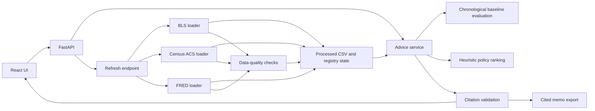

# Florida Policy Advisor architecture

## Supported end-to-end flow

Only labor market, housing, and fiscal paths are supported. Historical registry entries for other sources are explicitly unavailable: they have no active loader, no offered UI path, and no end-to-end analysis claim.

## API routes

- `GET /health`: health and supported-sector list.
- `GET /api/datasets`: provenance, availability, source mode, and refresh errors for every registered dataset.
- `POST /api/refresh`: refreshes the three supported sources. `?offline=true` restores fixtures without network access.
- `POST /api/advice`: produces evidence, evaluated-baseline outlook, heuristic options, citations, and a data-mode notice.
- `POST /api/memo`: creates a cited memo with the same provenance and limitations.

## Data and evidence rules

Loaders save live data separately from small offline fixtures. Each refresh records row count, schema fingerprint, required-field null rates, duplicate keys, invalid values, date range, and series coverage. Registry state records `live`, `fixture`, or `unknown` plus retrieval age, so a cached fixture cannot masquerade as a live refresh. Citation validation checks unique IDs, URLs, retrieval dates, numeric evidence references, forecast evaluation notes, and the heuristic-score disclaimer.

## Forecast rules

The application does not use a neural model. It evaluates naive last-value and linear-trend baselines with chronological holdouts, selects the lower-MAE method, and records both MAE and RMSE for both candidates. It withholds results for under-sized histories and for horizons beyond conservative limits. ACS state aggregation requires all 67 Florida counties and uses population weighting.

## Storage

- Raw live responses: `data/raw/<dataset_id>/` (ignored by git)
- Processed data: `data/processed/<dataset_id>/`
- Offline deterministic fixtures: `data/fixtures/<dataset_id>/`
- Provenance state: `data/registry_state.json`
- Memos: `outputs/memos/`
